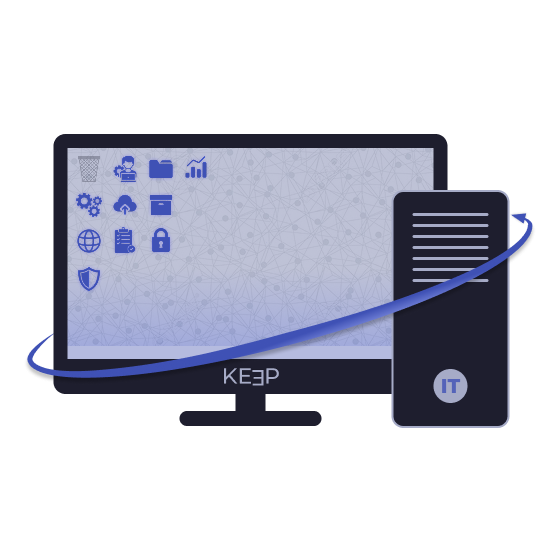
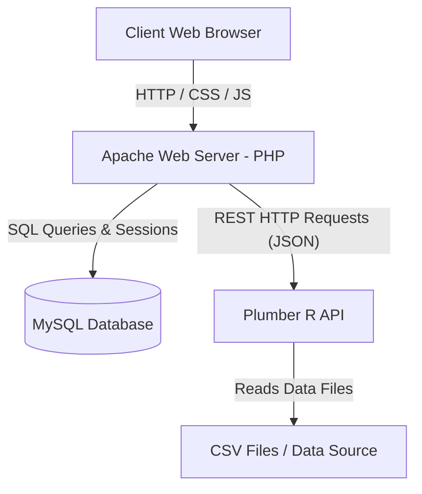

# 🖥️ KeepIT - IT Asset Management System

<p align="center">
  
</p>

<p align="center">
  <strong>A centralized, secure, and intelligent web platform for managing computer equipment.</strong>
</p>

<p align="center">
  
  
  
  
  
</p>

---

## 📌 Project Overview

**KeepIT** is a web application designed to centralize, optimize, and track an organization's IT assets. 

Developed as part of the second-year **SAE** (*Situation d'Apprentissage et d'Évaluation*) of the **BUT Informatique** (Bachelor of Technology in Computer Science) at **IUT de Vélizy-Villacoublay (UVSQ / Université Paris-Saclay)**, this year-long project was built by a team of 5 students.

The platform manages the inventory of IT hardware (computer units and monitors), handles device associations, and monitors warranties and hardware compliance via a statistical API in R, all while ensuring strict compliance with **GDPR** (*RGPD*) regulations and change logging.

---

## 👥 The KeepIT Team

| Student | Role & Main Responsibilities |
| :--- | :--- |
| **Théo PEYRONNET** | **Project Manager & Main Developer**<br>• Lead frontend and backend developer<br>• Database and user interface co-designer |
| **Nourâne ATHOUMANI** | **Head of Statistics**<br>• Developed the R Plumber API and statistical models<br>• Wrote statistical reports and deliverables |
| **Nicolas RACOT** | **Infrastructure Manager**<br>• Managed RPi 4 hosting configuration (Apache/SSH)<br>• Developed deployment and automation scripts |
| **Gabriel CHIFFLET** | **Database Manager**<br>• Designed the SQL schema, triggers, stored procedures, and views<br>• Authored specifications and ensured GDPR compliance |
| **Daniel RODRIGUES AMORIM** | **Art Director**<br>• Created the graphic charter and visual CSS styles<br>• Authored communication and design deliverables |

---

## ⚙️ System Architecture

The system is built around three main components:



1. **Web Server (Apache/PHP)**: Responsive user interface written in native PHP for business logic and access control.
2. **Database Server (MySQL)**: Relational storage for assets and security logs (automated change-tracking triggers, cleanup events).
3. **Statistical API (R/Plumber)**: Independent API loading data exports to compute statistics, projections, and hardware compliance metrics.

---

## 🚀 Key Features

### 💻 1. Inventory & Asset Management (CRUD)
* **Hardware tracking**: Manage computer units (name, CPU, RAM, storage, OS, MAC, purchase & warranty dates) and monitors (size, resolution, connectors).
* **Dynamic association**: Link monitors to computers dynamically.
* **Scrap List (Rebut)**: Soft deletion of assets. Deleted devices are sent to a scrap list. Administrators can block or unblock the scrap list to freeze movements.
* **CSV Import/Export**: Bulk import or export of IT assets with advanced filters.

### 🔑 2. Role-Based Access Control (RBAC)
* **Visitor**: Access without authentication to the home page and a restricted, anonymized view of the inventory.
* **Technician**: Day-to-day asset operations (CRUD, CSV import/export, scrap list assignment).
* **Web Admin**: Manages technician accounts, configures reference tables (operating systems, manufacturers, device types), and toggles the scrap list lock.
* **System Admin**: Exclusive access to system logs. Cannot modify assets (ensuring segregation of privileges).

### 📊 3. Integrated Statistical Dashboard (R)
Connected directly to the R Plumber API, the dashboard provides:
* **Compliance analysis**: Percentage of compliant computers per site based on minimum RAM and storage requirements.
* **Warranty expiration projections**: A timeline predicting device warranty expirations over the next $N$ months, grouped by manufacturer.
* **Connection tiers**: User activity categorization.
* **Hardware alerts**: Automated detection of underperforming screens or computers.

### 🛡️ 4. Security & GDPR Compliance (CNIL guidelines)
* **Detailed audit trail**: Database triggers record every insert, update, and delete, linking them to the active session user (`@current_user`).
* **Limited data retention**: A daily MySQL event running at 2:00 AM automatically purges logs older than 30 days (`clean_inf_month_logs` procedure).
* **IP Banning**: Security module tracking and banning malicious IP addresses.
* **Automatic Maintenance Mode**: If the MySQL database is offline, the application seamlessly redirects to a maintenance screen without leaking details.

---

## 🛠️ Installation & Deployment

### 📋 Prerequisites
* A web server supporting **PHP (>= 8.0)** (e.g. Apache on Raspberry Pi, or XAMPP/WampServer).
* A **MySQL** or **MariaDB** database server.
* **R-base** with the `plumber` library installed.

---

### 🗄️ 1. Database Setup

Database configuration files are located in the [Conception/Database/](file:///d:/Developpement-Hacking/sae-KeepIT/Conception/Database) directory.
Import them into your MySQL server in the following exact order:

1. `init.sql`: Sets up the database schema `keepit` and base asset tables (`devices`, `computer`, `monitor`).
2. `inserts.sql`: Pre-populates references and constants (OS, manufacturers, connectors, etc.).
3. `logs_database.sql`: Sets up log tables and audit triggers.
4. `Views.sql`: Creates database views for dashboards, search, and CSV exports.
5. `action.sql`: Registers stored procedures and the daily cleanup event scheduler (`clean_logs_daily`).

*Note: If your database was initialized with old files and needs adjustments for IP addresses or manufacturer fields, apply `mig_manufacturer_name.sql` and `mig_ip_addr.sql` migration scripts.*

---

### 🌐 2. PHP Server Configuration

1. Copy the contents of the `src/` folder into your Apache public directory (e.g. `/var/www/html/` or `htdocs/`).
2. Set up database credentials in [db.php](file:///d:/Developpement-Hacking/sae-KeepIT/src/includes/db.php):
   ```php
   $GLOBALS['connect'] = @mysqli_connect("localhost", "username", "password", "keepit");
   ```

---

### 📊 3. Starting the R Plumber API

R scripts and the API router are located in [Conception/Statistiques/](file:///d:/Developpement-Hacking/sae-KeepIT/Conception/Statistiques).

#### 🐧 Deploying on Linux (Debian / Ubuntu / Raspberry Pi)
1. Install R and system dependencies:
   ```bash
   sudo apt update
   sudo apt install r-base libsodium-dev libcurl4-openssl-dev libssl-dev -y
   ```
2. Install Plumber in the global R environment:
   ```bash
   sudo -i R -e "install.packages('plumber', repos='https://cloud.r-project.org')"
   ```
3. Set up a systemd service to run the API in the background. Create `/etc/systemd/system/r-stats-api.service`:
   ```ini
   [Unit]
   Description=KeepIT R Plumber API
   After=network.target

   [Service]
   ExecStart=/usr/bin/Rscript -e 'library(plumber); pr <- plumb("router.R"); pr$run(host="0.0.0.0", port=8000)'
   WorkingDirectory=/var/www/html/Conception/Statistiques
   Restart=always
   User=www-data

   [Install]
   WantedBy=multi-user.target
   ```
4. Start and enable the service:
   ```bash
   sudo systemctl daemon-reload
   sudo systemctl enable r-stats-api.service
   sudo systemctl start r-stats-api.service
   ```

#### 🪟 Deploying on Windows
1. Install R from the official CRAN website.
2. Install the Plumber package inside the R console:
   ```r
   install.packages("plumber")
   ```
3. Adjust and run a script batch file `.bat` to start the API:
   ```bat
   @echo off
   "C:\Program Files\R\R-4.x.x\bin\Rscript.exe" -e "pr <- plumber::pr('C:/Path/To/sae-KeepIT/Conception/Statistiques/router.R'); pr$run(port=8000)"
   pause
   ```
   *(Keep the command window open while testing the application to ensure the API is reachable).*

For more details on Plumber endpoints, consult the dedicated installation instructions in [Plumber-FR.md](file:///d:/Developpement-Hacking/sae-KeepIT/Plumber-FR.md).

---

## 🔐 Default Test Accounts

Use these default credentials to test the various access levels:

| User Profile | Username (Login) | Password |
| :--- | :--- | :--- |
| **Web Administrator** | `adminweb` | `adminweb` |
| **System Administrator** | `sysadmin` | `sysadmin` |
| **Technician (Default)** | `tech1` | `*tech1*` |

---

## 📁 Repository Structure

```text
├── Conception/            # Database diagrams and scripts (SQL & R)
│   ├── Database/          # SQL scripts (Init, Inserts, Triggers, Views, Actions)
│   └── Statistiques/      # R analysis scripts and Plumber Router API
├── Docs/                  # Reports, specifications, and GDPR files
├── analyse/               # Specifications and Needs Analysis (ADB)
├── spec/                  # Design specifications
└── src/                   # PHP source code
    ├── actions/           # Form handlers and backend operations
    ├── components/        # Reusable user interface components
    ├── includes/          # Helpers, tools, and database connection scripts
    ├── pages/             # Frontend web pages (HTML/PHP templates)
    └── styles/            # Vanilla CSS stylesheets
```
