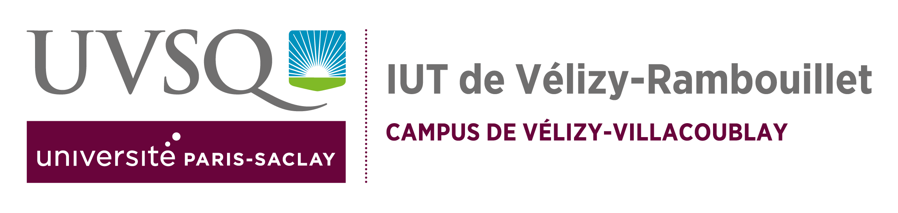

# Cahier des charges

## Introduction

### Information générales du document

Le présent cahier des charges constitue le document de référence pour le projet de développement d’une plateforme WEB de gestion de parc informatique. Il définie l’ensemble des spécifications techniques et fonctionnelles auxquelles devra répondre la solution développée. Ce document s’adresse aux différentes parties prenantes du projet (enseignants et élèves).

### Objectif du document

Ce cahier des charges a pour objectif de :

- Définir le périmètre fonctionnel de la plateforme Web.
- Spécifier les exigences techniques et les contraintes à respecter lors de la réalisation.
- Décrire l'architecture techniques de la solution.
- Etablir les rôles et différents droits.
- Fournir le référentiel commun pour les acteurs du projet afin d'assurer la compréhension.

### Présentation du projet

Le projet consiste en la réalisation d’un plateforme Web de gestion de parc informatique développée en PHP avec une base donnée MySQL. Cette application web permettra de gérer l’inventaire du matériel informatique d’un organisation à travers différents modules accessibles selon quatre profils utilisateurs. L’admirateur système, l’administrateur web, le technicien et le visiteur.
La plateforme sera hébergée sur un serveur Raspberry Pi4. Il comportera un système de journalisation complet de toutes les actions. Enfin, l’ensemble du code source, la documentation et les informations sur le projet devront être partagé via GitHub.

### Structure du document

- Section 1 : Présentation détaillé du contexte et de l'environnement technique.
- Section 2 : Connaissances et compétences nécessaires.
- Section 3 : Consignes fonctionnelles et techniques à respecter.

## Enoncé

### Etat des lieux

Actuellement, les information relatives aux équipements informatiques sont dispersées, difficiles à mettre à jour et à consulter. L'absences d'un système centralisé de gestion entraine:

- Une difficulté de traçabilité
- Un manque de visibilité
- Une collaboration difficile

### Administration

#### Droits

Quatre profils utilisateurs sont définis :

Parmi eux, celui qui n'a pas besoin de se connecter :

- Le visiteur qui peut consulter une partie restreinte de l'inventaire.

Les autres utilisateurs se connectent via la fonctionnalité de connexion avec identifiant, mot de passe pour effectuer leurs actions.

- L'administrateur système s'occupe uniquement de la gestion du système et des logs. Il consulte les journaux d'activité sans se pencher sur l'activité web gestion du parc.
- L'administrateur web de la plateforme, il est unique. Il créer et supprime un technicien, créer des informations sur les machines. (ex: rajouter un type de système d'exploitation sélectionnable par le technicien), consulter les liste des machines et bloquer la liste du *rebut*  (désactiver temporairement le déplacement depuis/vers cette liste)
- Le technicien peut consulter les listes des machines (moniteurs, unités centrales et rebut), ajouter des machines, supprimer des machines (c'est à dire la déplacer vers la liste du rebut). Exporter les listes. Modifier les information d'une machine à partir des caractéristiques disponibles.

#### Connexion

Le serveur devra être accessible via les postes informatiques par accès SSH.
Le serveur est de type RPI4.

Les identifiants de connexion sont :

- Login : sae2025

- Mot de passe : !sae2025!

Des identifiants et mots de passe sont définie et inchangeable pour certains utilisateurs : 

- Pour l'administrateur système : 
  
  - Login : sysadmin
  
  - Mot de passe : sysadmin

- Pour l'administrateur web:
  
  - Login : adminweb
  
  - Mot de passe : adminweb

- Pour le premier technicien:
  
  - Login : tech1
  
  - Mot de passe : $*$tech1$*$

Les identifiants des techniciens créé par l'administrateur web sont définie à la création de leur compte par l'administrateur web lui-même. 

### Structures des données à respecter

### Outils de pilotage

L'interface web doit permettre la visualisation rapide et efficace des informations sur le parc informatique.

Les outils principaux seront :

- Un tableau de bord général.

- Des tableau de visualisation des listes du matériel (moniteurs, unité central, rebut) avec filtre sur certain attributs.

- Une interface de consultation des logs pour l'administrateur système.

- Une interface de gestion des techniciens pour l'administrateur web.

### Objectifs de la solution

#### Objectifs Techniques

Les objectifs techniques couvrent la reprise de données existante au format cdv des machines. La mise en place d'une base de données pour accueillir ces données.

Un serveur Web (apache) pour mettre à disposition le site et un accès SSH. Mettre en ouvre une architecture et des méthodes de sécurisation.

#### Objectifs Fonctionnelles

Apporter de la fiabilité aux processus métier via la mise en place de ce système. C'est à dire par la traçabilité complète du matériel

La consultation de l'inventaire et la gestion du matériel via l'interface web.

- Ajout de nouvelles machines

- Modifier des informations existantes

- Supprimer des équipements

- Suivre la statut

Améliorer la gestion du parc en regroupant les informations pour, en apportant des indicateurs (graphiques, statistiques, ...)

## Pré-requis

### Compétences

Les pré-requis pour le projet sont l'ensemble des ressources dispensées durant la formation allant de la R3.01 à la R3.13 :

- Développement Web

- Développement efficace

- Analyse

- Qualité de développement

- Programmation systèmes

- Architecture réseaux

- SQL et programmation

- Probabilités

- Cryptographie

- Management SI

- Droit contrats et numérique

- Anglais

- Communication professionnelle

### Logiciels

Les environnement de développement tel que 

- PHPStrom

- VSCode

La maitrise des logiciel annexes comme les suites bureautiques, la connaissance de `markdown` et de GitHub.

## Priorités

La liste ci-dessous des travaux à effectuer et son ordre peut être amener à être modifier.

1. La charte graphique du site à rendre pour la dernière semaine de décembre 2025

2. Une maquette de la plateforme web en `html` et `css`

3. Une présentation en anglais du projet

---

